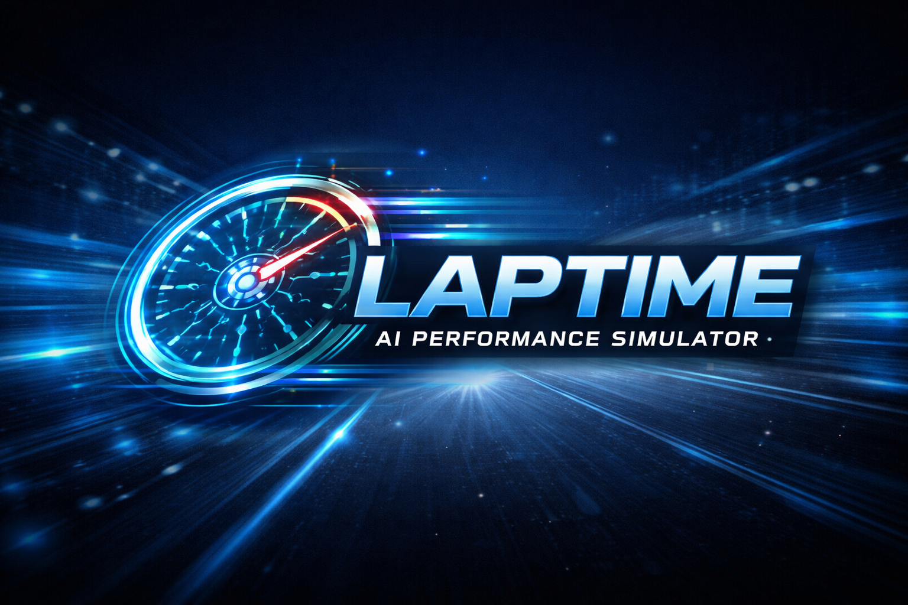

<p align="center">
  
</p>

# LapTime

**Test-drive local LLM hardware before you buy.**

[Visit the live site: `https://laptime.run`](https://laptime.run)

LapTime turns benchmark numbers into something engineers can actually feel.
Instead of staring at isolated `tok/s` figures, you can pick hardware, models,
and workloads, then watch the tradeoffs play out across prompt ingest, time to
first token, and streamed output.

## Why it exists

Benchmark tables answer "what is faster?"

LapTime answers:

- How long will I wait before the model starts talking?
- Which part is slow: prompt processing, TTFT, or generation?
- Will this rig actually fit the model I want to run?
- How different will an Apple laptop feel from a GPU tower or a GB10 box?

## Live product

- Production: [https://laptime.run](https://laptime.run)

## Current features

- Interactive simulator for local LLM workloads
- Hardware, model, and workload selection with searchable controls
- Platform-aware hardware filtering
- Color-coded fit warnings for likely broken or risky combinations
- Segmented playback timeline for prompt ingest, TTFT, and token generation
- Side-by-side comparison view
- Model browser grouped by recency, with a source explorer
- KV cache compression modes (llama.cpp q8/q4, TurboQuant) folded into the fit math
- Bring-your-own-model import from Hugging Face
- In-app methodology section that explains measured versus estimated versus community-backed laps
- Cloudflare Pages deploys on every push to `main`

## Hardware coverage

The catalog includes a mix of exact benchmark-backed entries and clearly marked
estimate-based entries across:

- Apple Silicon laptops and desktops
- NVIDIA consumer, workstation, and datacenter GPUs
- GB10-class systems such as DGX Spark and partner variants
- AMD Strix Halo systems, including Framework, HP, ASUS, and community-tracked mini PCs

## Model coverage

The catalog is grouped into three recency tiers so the current generation is what
you see first:

- **Current generation** — GLM-5.2, DeepSeek V4 Flash, Qwen3.6, Gemma 4, Ornith 1.0,
  Laguna-S 2.1, Bonsai 27B (1-bit and ternary), GPT OSS, Nemotron 3
- **Still widely run** — Llama 3.1 8B, Mistral Small, Ministral, Nemotron Nano
- **Calibration baselines** — collapsed by default. These older rows are kept because
  LapTime's estimation curve is fitted against their measured LocalScore runs, not
  because they are a recommendation.

Where a model ships as GGUF, memory footprints are the **summed sizes of the actual
published `.gguf` blobs** rather than a parameter-count estimate, so a "won't fit"
badge reflects a file you can really download.

## Data philosophy

LapTime tries to stay honest about source quality.

- Exact benchmark rows are labeled from structured sources like LocalScore
- Community/forum observations stay separate from high-confidence benchmark data
- Newer or harder-to-source systems are included as estimates only when labeled clearly
- Architecture matters and is modeled explicitly: MoE rows scale on active parameters,
  not total, and MLA/sparse-attention models get their own KV-cache factors
- Low-bit rows (Bonsai 1-bit, ternary) model decode from the weight footprint rather
  than the parameter count, and say so
- Fit checks are guardrails, not guarantees; long context, KV cache growth, backend choice, and offload behavior still matter

## Stack

- React 19
- Vite 8
- Plain CSS with a custom design system
- Cloudflare Pages for hosting
- GitHub Actions for automatic deploys

## Local development

```bash
npm install
npm run dev
```

## Quality checks

```bash
npm run lint
npm run build
```

## Deployment

LapTime deploys to Cloudflare Pages from GitHub Actions on pushes to `main`.

Required repository secrets:

- `CLOUDFLARE_API_TOKEN`
- `CLOUDFLARE_ACCOUNT_ID`

Workflow:

- [`.github/workflows/deploy-cloudflare-pages.yml`](./.github/workflows/deploy-cloudflare-pages.yml)

If you need to create the Pages project manually, use:

- Framework preset: `Vite`
- Production branch: `main`
- Build command: `npm run build`
- Output directory: `dist`

## Roadmap

- Expand benchmark ingestion from more structured sources
- Expand the new methodology and source-quality experience into deeper attribution pages
- Broaden buyer flows and hardware landing pages
- Improve context-aware fit modeling for long prompts and offload-heavy runs

## Contributing ideas

If you have benchmark data, hardware ideas, or real-world validation feedback,
open an issue or share the site with another engineer and tell us where the
simulator feels right or wrong.

## License

The code in this repository is licensed under the MIT License.

Benchmark data, source links, and third-party referenced materials remain
subject to their respective licenses, terms, and attribution requirements.
LapTime's code license does not imply relicensing of third-party data or
source content.
